# Table of Contents 

1. [**Introduction**](#Introduction-&-Site-Purpose)
2. [**User Experience (UX)**](#User-Experience-(UX))
    * [Project goals](#Project-goals)
    * [Target audience](#Target-audience)
    * [User stories](#User-stories)
    * [Structure](#Structure)
    * [Design](#Design) 
      * [Colour scheme](#Colour-scheme)
      * [Typography](#Typography)
      * [Imagery](#Imagery)

3. [**Features**](#Features)
    * [Existing Features](#Existing-Features)
    * [Features to be implemented in the future](#Features-to-be-implemented-in-the-future)

4. [**Technologies used**](#Technologies-used)
    * [Languages](#Languages)
    * [Frameworks, libraries and programs used](#Frameworks,-libraries-and-programs-used)

5. [**Deployment**](#Deployment)
    * [Deploying to GitHub Pages](#Deploying-to-GitHub-Pages)
    * [Forking to GitHub Repository](#Forking-to-GitHub-Repository)
    * [Making a local clone](#Making-a-local-clone)

6. [**Testing**](#Testing)
    * [Testing Approach](#Testing-Approach)
    * [User stories testing from the UX section](#User-stories-testing-from-the-UX-section)
    * [Validator Testing](#Validator-Testing)
    * [Lighthouse Testing](#Lighthouse-Testing)
    * [Further Testing](#Further-Testing)
    * [Issues and Bugs](#Issues-and-Bugs)

7. [**Credits**](#Credits)
    * [Code](#Code)
    * [Images](#Images)
    * [Content](#Content)
   
8. [**Acknowledgments**](#Acknowledgments)


<br>

# Moonlight Quiz

[Visit live page here](https://renatabiniek.github.io/moonlight-quiz/)

<br>

## Introduction & Site Purpose
---

### Fancy playing a literary moon quiz?
<br>

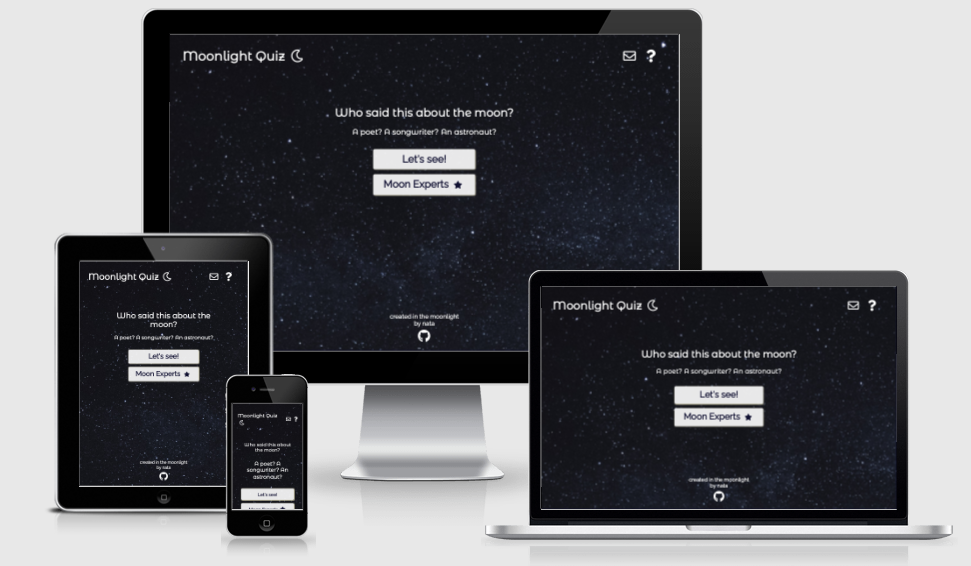

This interactive front-end site was built as part of my portfolio project JavaScript Essentials.

It's a traditional interactive online quiz with a literary twist.
Instead of a question, a quote about a moon is displayed, and the players are presented with multiple choices to guess the author of the quote.

## User Experience (UX)
---

### Project goals

* to build a functioning quiz using JavaScript
* to present a fun online quiz themed around the moon and quotes from (mainly) literature

### Target audience for this website is:

* People who enjoy a fun online quiz
* Avid readers who want to test their knowledge and memory
* Adults, or  well-read teenagers
* Moon lovers

### User stories:

* **As a player:**

* I want to be able to play the quiz when I'm ready
* I want to be able to play the quiz on the go
* I want to for the quiz to be easy to navigate
* I want to see my progress and my score
* I want to be able to contact the site owner with my feedback

* **As site creator:**

* I want to create a interactive online application based on JavaScript Essentials
* I want to present the users an attractive, responsive site

### Structure:

The user's journey begins on a minimal home page where they are presented with an option to read instructions on how to play the quiz or take action to start the game.
The logo and highest priority elements that might be useful to the player are conventionally placed in a horizontal fashion at the top of the browser window. 
For consistency of user experience, the site logo and footer are repeated on the the home page and quiz page. 

The logo element allows the user to quickly navigate back to home page.
The footer includes information about the site owner, including a link to the GitHub repository that opens in a new tab.

### Design:  

* **Colour scheme**

I wanted to make the page consistent with the moon theme, so I decided on dark colour scheme, that would imitate the night sky.
That also give the site an elegant, minimal look, and eliminates distractions for the user.

The colors used are:

* white - rgb(255, 255, 255) for text placed on the image background for best contrast

* deep nightsky navy - rgb(15, 15, 48) for fallback background colour and text elements on buttons

* shades of gold - for glow effect rgb(255,215,0) & (231, 225, 189)

* dark blue - rgb(16, 46, 74) for modal background
 
The blues were derived from the background image colours using [Eye Dropper](https://eyedropper.org/).

For correct/incorrect answer selections, I used standard

* aquamarine (correct) - rgb(127, 255, 212) &
* red (incorrect) - rgb(255, 0, 0)

<br>

* **Typography**

    The fonts were sourced from [Google Fonts](https://fonts.google.com/)

    Two fonts were selected for this project:

* 'Montserrat Alternates', sans-serif - for logo and intro elements, with sans-serif as a fallback font in case the original font family isn't imported correctly for some reason. The font design is fun but still very readable, I felt it tied in well with the theme of the quiz.

* 'Raleway', sans-serif - for body text. The font is elegant, popular and clean, which ensure that questions and answers of the quiz will be easy to read.
Sans-serif is the fallback option.  
<br> 

* **Imagery**

    Only one image was used for this project.
    It's an image of a night sky that provides a themed backdrop for the quiz.
    It was sourced from [Unsplash](https://unsplash.com/).
    
    Moon & star icons from [Font Awesome](https://fontawesome.com/) were used in logo, progress bar and on the high scores button to ensure a cohesive feel of the site.
<br>

## Features
---

### Existing Features

Existing features include:

* **Navigation section**

In the typical navigation section of the site, I have added a fun logo that glows when the player hovers over it, and that also takes the player to the home page from any stage of the quiz.

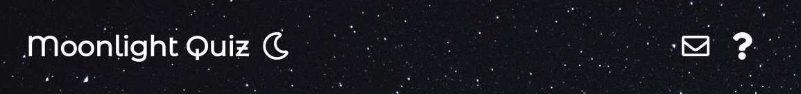

Logo:

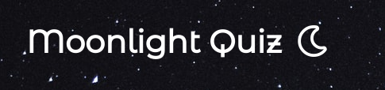

Logo on hover:

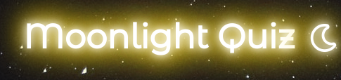

Two icons have been placed on the right hand side (with the same glow effect) to allow the player to easily access information about the quiz game and contact the site owner.


Modal opens when user clicks the **?** icon. It can be closed with **X** icon inside the modal.

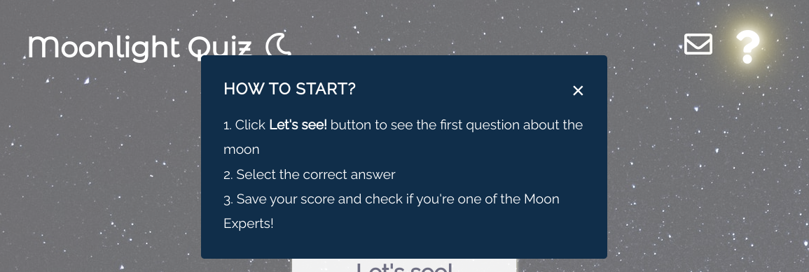

Another modal with a contact form opens when user clicks the envelope icon. It can be closed with **X** icon inside the modal.
The form inputs are set as required and validate the email format on input.

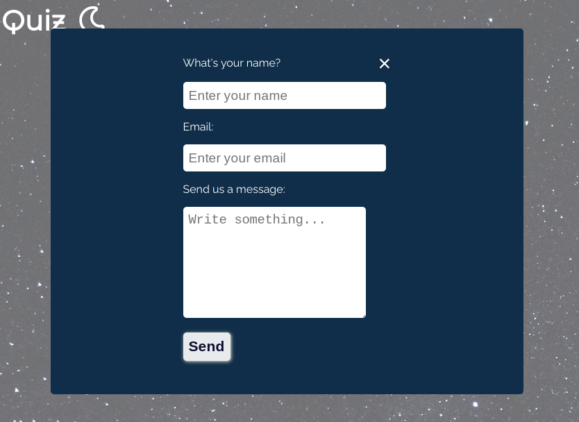

Once message is submitted, a thank you message is displayed for the user and form input text is cleared.

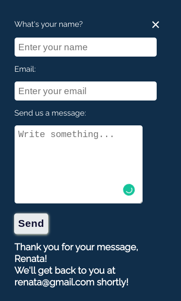


* **Home page with call to action**

On the home page, the user can start the quiz by pressing the **Let's see!** button.

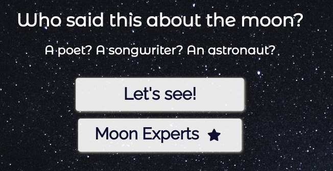

Moon Experts button doesn't currently take the users to the score board but this will be implemented in the future.

* **Footer**

Minimal footer is placed conventionally at the bottom of the page.
For consistency, it has been added to both, home and quiz pages.
It includes info about the site's author and a link to the GitHub repository, with the GitHub icon that has the same glow on hover effect.
The link opens in a new window when clicked to ensure uninterrupted experience on the site.

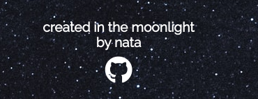

* **Game page**

Once the player decides to start the quiz, they are taken to the quiz page.
This page has a very similar look and layout, and includes:

* Progress section

In this section, the user can see how many questions have been shown, how many are in the quiz round and what is their current round score.
Each time a new question is displayed, the question number increases and a new glowing moon icon is added, to indicate progress in a way that ties in with the overall look of the site.

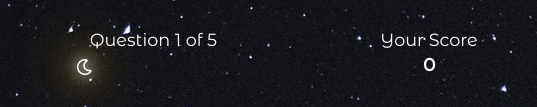

* Question and answers area

When a new question is displayed, the user is presented with 4 possible options. 

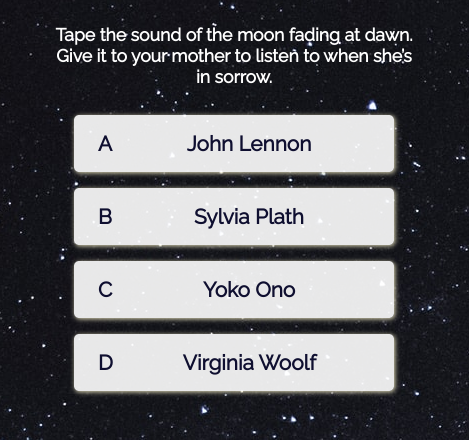

Selected option increase slightly to stand out from the other choices.
When correct option is selected, the answer button becomes aquamarine blue.
When the answer is incorrect, it turns red.

Correct answer:
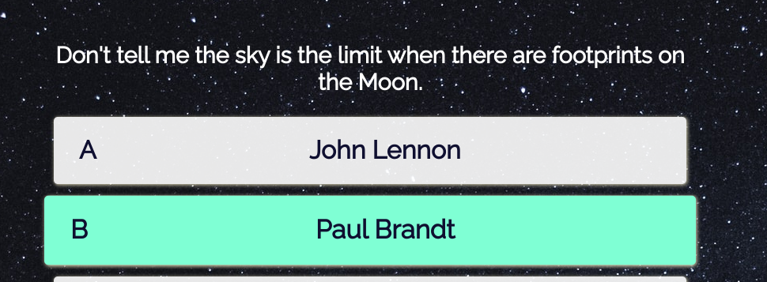

Incorrect answer:
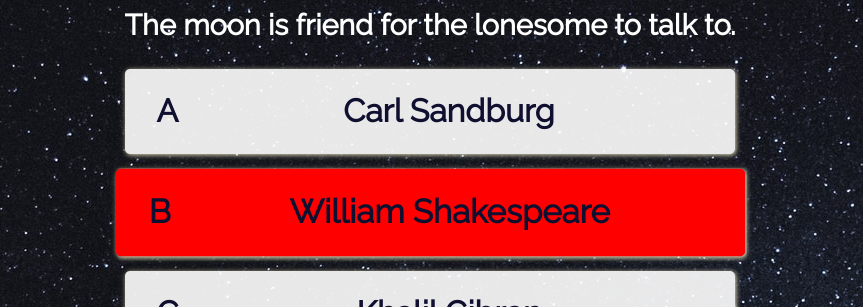

The questions and selected answer is then displayed for 2.5 seconds to allow the player to consider their choice.

* Game over modal

Once last question is displayed, a game over modal pops up to inform the user that the quiz has finished.
The final score of the round is displayed. The players has an option to play the quiz again, go back to the home page or close the modal.

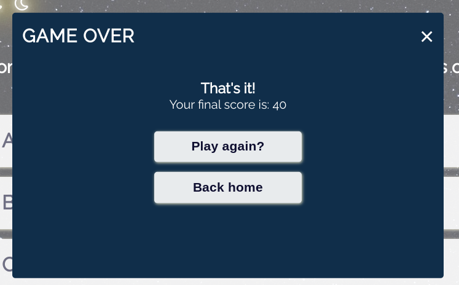

### Features to be implemented in the future

The project has been developed within a very limited time window and under added pressure of personal circumstances, therefore it has a lot of potential for features to be implemented in the future.

They will include:

* add option to save current score and username to local storage
* display top scores on the leader board
* add more questions and shuffle the answers

## Technologies used
---

### Languages

* [HTML5](https://en.wikipedia.org/wiki/HTML5)
* [CSS3](https://en.wikipedia.org/wiki/CSS)
* [JavaScript](https://en.wikipedia.org/wiki/JavaScript)

### Frameworks, libraries and programs used

* [Google Fonts](https://fonts.google.com/) - to import fonts into the HTML file which were then used throughout the site
* [Font Awesome](https://fontawesome.com/) - to source icons which were added to the site for the purpose of aesthetics
* [Eye Dropper](https://eyedropper.org/) - to pick specific colours from images 
* [Chrome DevTools](https://developer.chrome.com/docs/devtools/) - to inspect and debug the code through all stages of the development
* [Unicorn Revealer](https://chrome.google.com/webstore/detail/unicorn-revealer/lmlkphhdlngaicolpmaakfmhplagoaln?hl=en-GB) - to inspect the site for overflow 
* [Lighthouse](https://developers.google.com/web/tools/lighthouse) - to audit the site for performance, accessibility, SEO and best practices
* [Am I Responsive](http://ami.responsivedesign.is/) - to produce a preview of the site on different devices
* [W3C HTML Validator](https://validator.w3.org/) - to validate HTML code
* [W3C CSS Validator](https://jigsaw.w3.org/css-validator/) - to validate CSS code
* [JSHint Validator](https://jshint.com/) - to validate JavaScript code
* [Color Contrast Accessibility Validator](https://color.a11y.com/Contrast/) - to test the contrast and readability of colours used 
* [Autoprefixer](https://autoprefixer.github.io/) - to add vendor prefixes to CSS, for compatibility with different browsers
* [GitHub](https://github.com/) - for hosting the project code and version control 
* [Gitpod](https://gitpod.io/) - to write the code and push it to GitHub
* [GitHub Pages](https://pages.github.com/) - to deploy the site 
* [Word Counter](https://wordcounter.net/character-count) - to limit number of characters used for commit messages to 50, max 72 characters
* [Online-Spellcheck](https://www.online-spellcheck.com/) - to spellcheck the content of the site and README

## Deployment
---
### Deploying to GitHub Pages

The project was developed in GitPod, committed to Git and pushed to GitHub. 
The site was deployed to GitHub Pages with the following steps:

1. Login to GitHub
2. Navigate to your site's repository, which for this project is renatabiniek/moonlight-quiz
3. At the top of the repository, locate and click **Settings** 
4. In the left-hand side panel, click **Pages**
5. Under **Source**, click the dropdown called *None* and select *Branch: Master* and *Root* folder
6. Click **Save**
7. A notification message will show up that the page is getting ready to be published
8. Once refreshed, the message will change to *Your site is published* and a link to the deployed site will be provided: 

    The live site can be found here: https://renatabiniek.github.io/moonlight-quiz/

The process can also be found [here](https://docs.github.com/en/pages/getting-started-with-github-pages/configuring-a-publishing-source-for-your-github-pages-site).

### Forking to GitHub Repository

You can create a fork (copy) of the repository. This allows you to experiment with the code without affecting the original project.

To fork the repository:

1. Log in to your [GitHub](https://github.com/) account 
2. On GitHub, navigate to the repository you want to fork
3. In the top right corner of the page, underneath your profile avatar, click **Fork**
4. You should now have a copy of the original repository in your GitHub account

### Making a local clone

You can clone your repository to create a local copy on your computer. Any changes made to the local copy will not affect the original project. To clone the **Moonlight Quiz** project, follow the steps below:

1. Log in to your [GitHub](https://github.com/) account and locate the [Moonlight Quiz repository](https://github.com/renatabiniek/moonlight-quiz)
2. In the repository, click on **Code** button located above all the project files
3. Under HTTPS, copy the link generated (https://github.com/renatabiniek/moonlight-quiz.git)
4. Open the terminal you're using, e.g. Gitpod
5. Change the current working directory to the location where you want the cloned directory created
6. Type ```git clone``` and then paste the URL you copied earlier:  
```git clone https://github.com/renatabiniek/moonlight-quiz.git``` 
7. Press **Enter** to create your local clone.

You can also refer to this [GitHub documentation](https://docs.github.com/en/github/creating-cloning-and-archiving-repositories/cloning-a-repository-from-github/cloning-a-repository) for detailed instructions. 

## Testing
---

### Testing Approach

I tested the site regularly during the development process, by previewing it in the live server window and inspecting with Google Chrome DevTools and Console. Simultaneously, I was checking any new additions and changes on several devices available in my household, such as a phone, tablet and laptop with several versions of browsers (Google Chrome, Firefox, Edge, Safari).
Any issues found, were addressed at that stage and double checked before moving on with the rest of the project. 

In the final stage of the project, I have tested the site thoroughly with automatic validators and manually on different devices and in several browsers, taking into account user stories from the UX section, as per below.

### User stories testing from the UX section

* **As a player:**

* I want to be able to play the quiz when I'm ready

The quiz doesn't load automatically, it allows the user to pres the *Let's see!* button to initiate start

* I want to be able to play the quiz on the go

The game is responsive on different screens and devices

* I want to for the quiz to be easy to navigate

The navigation is intuitive and the user always has an option to return to the home page by pressing logo of the site

* I want to see my progress and my score

Scores and question count/ quesiton total are displayed above the questions & answers section at all times.
Final score is also announced on the pop up end game modal.

* I want to be able to contact the site owner with my feedback

A simple contact form is easily available in the main navigation menu. A thank you message printed back to the user confirms that the query was received.


### Validator Testing

* **HTML Validator**

I ran both html files through the validator, and found following errors and warning:

* Index.html

  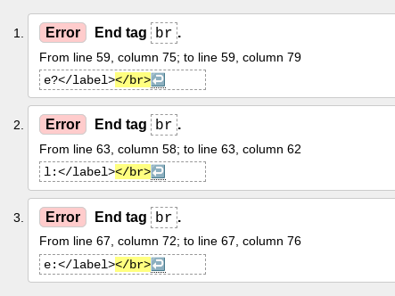

* Quiz.html

  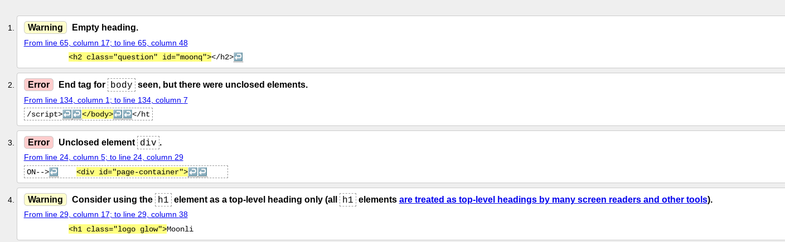

Errors and warnings have been fixed, but I left the choice of the h1 element for my logo.

* **CSS Validator:**

No errors found in CSS.

  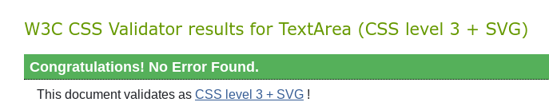

* **JSHint Validator:**

No errors but multiple warnings about missing or unnecessary semicolons received.
All fixed.


### Lighthouse Testing

I ran the Lighthouse tests in incognito mode as some Chrome extensions were negatively impacting the results.
All tests came back with good results:

  **Desktop**

  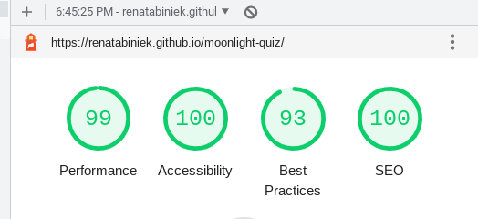

  **Mobile**

  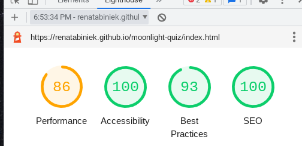

### Further Testing

* **Color Contrast**

    [Color Contrast Accessibility Validator](https://color.a11y.com/Contrast/)

Result:

    *No automated color contrast issues found on the webpage tested*

### Issues and Bugs

Developing this JavaScript project has been a steep learning curve for me and I was faced with many challenges of general use of the language during the process, which has been an impediment to the completing all the features I intended to. 

  * **Fixed**:

* It was possible to select further options after selecting an answer. 
This was resolved by adding selectionPossible = true to various steps of the quiz, changing it to false when the click event occured and returning the function when selectionPossible = false;

* The questions continued to display even after max number of questions was reached

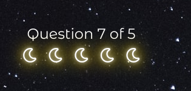

This was fixed by adding an if condition to return (stop running) the setNewQuestion function once the max. number of questions has been reached.

* Score was being added but not as numbers but strings (0 + 20 + 20 = 02020). It was due to me incorrectly using innerText in the incrementScore() function, rather than numbers. 

* Moon icons were being shown all at once, rather than one by one with each new question.
This was again my own erorr and was resolved with toggle visibitlity from w3schools.

* Error 404 page showed when I deployed the page in GitHub. This was due to an absolute file path that I used. It was fixed when I changed it to relative.

* **Known**:

* Not a bug, but I realised late in the project that having multiple files isn't as helpful as I thought it would be. Instead of helping me separate specific aspects of the project, it made it more difficult to refer to specific values and elements. This will be corrected in the future.

* I experimented with the saving and getting scores and usernames to local storage but the values are not getting submitted correctly. I spent a lot of time reading and watching various tutorials but unfortunately I ran out of time to fix this.

### Credits
---

#### Code

I found JavaScript concepts extremely difficult to put in practice on my own project, so I used a lot of help in form of tutorials, articles and other projects.

Credits are due to:

* Video tutorials of [Brian Design](https://www.youtube.com/watch?v=f4fB9Xg2JEY&t=3196s) and [Web Dev Simplified](https://www.youtube.com/watch?v=riDzcEQbX6k&ab_channel=WebDevSimplified) helped me massively with the building blocks of a quiz game

* The Code Institute materials with the support of tutorial materials on [w3schools](https://www.w3schools.com/), [MDN Web Docs](https://developer.mozilla.org/en-US/) and posts on [stackoverflow](https://stackoverflow.com/) were used to create this site. 

* I reviewed similar projects of my fellow students for reference to better understand the practical use of JS concepts for this project [zokam1411](https://github.com/zokam1411/milestone-project-2) and [roomacarthur](https://github.com/roomacarthur/the-tipsy-quiz)

* [This blog post](https://chris.beams.io/posts/git-commit/) was used for recommendation on best format of git commit messages

#### Images 

Background image was sourced from [Unsplash](https://unsplash.com/photos/Ef6iL87-vOA)

#### Content

Quotes were sourced from [Goodreads](https://www.goodreads.com/quotes/tag/moon)

### Acknowledgments
---
Massive thank you to:

* The wonderfully helpful and friendly Slack community where I often looked for help
* Tutors at Code Institute for their extended support 
* My partner who took over running the household and let me work on this project

[BACK TO TOP](#Table-of-Contents)